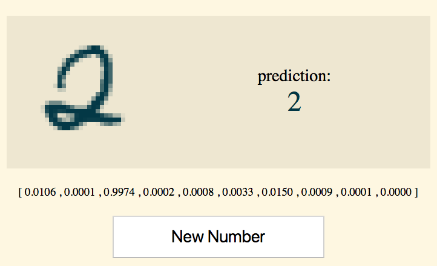

# LearnYouMLjs

Learn the fundamental basics of machine learning in Javascript by setting your very own mnist project using brain.js!



## Getting Started

These instructions will get you a copy of the project up and running on your local machine for development and testing purposes.

### Installing

To set up the project on your local machine, download project dependencies.
```
npm install
```

## Running the tests

Build a model by running:
`node createMnistModel.js`

Then, to test our your model, open up `mnist-demo.html`

## Authors

* **Bryan Manuele** - *Initial work* - [FermiDirak](https://github.com/FermiDirak)

## License

This project is licensed under the MIT License - see the [LICENSE.md](LICENSE.md) file for details